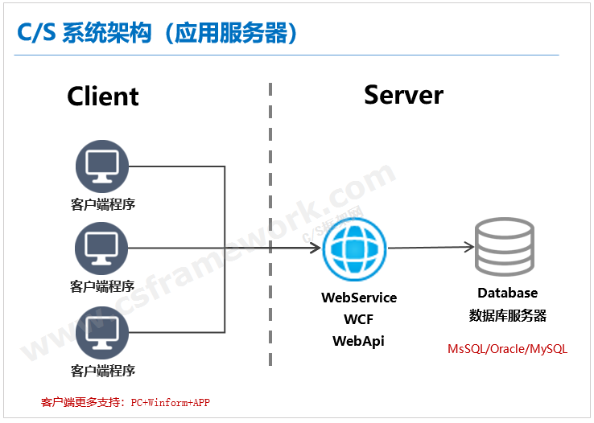
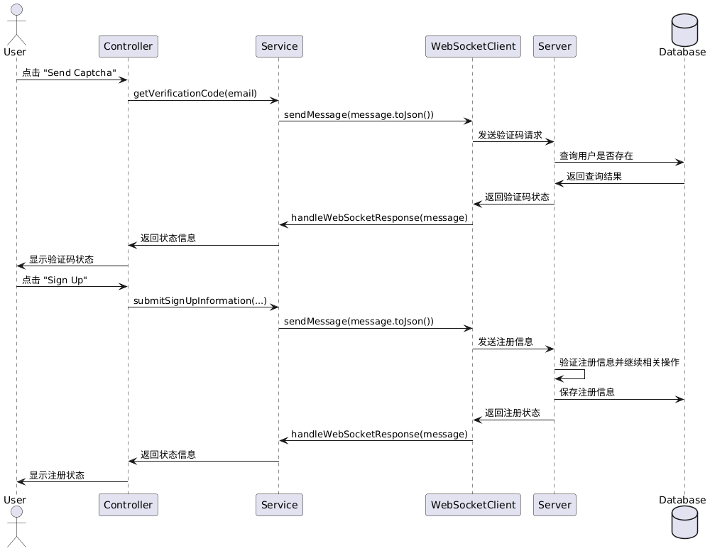
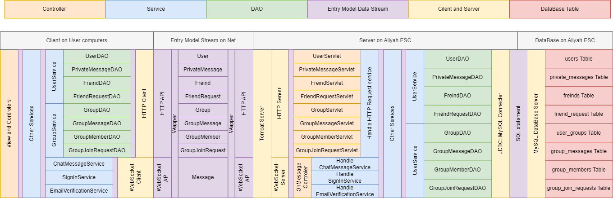
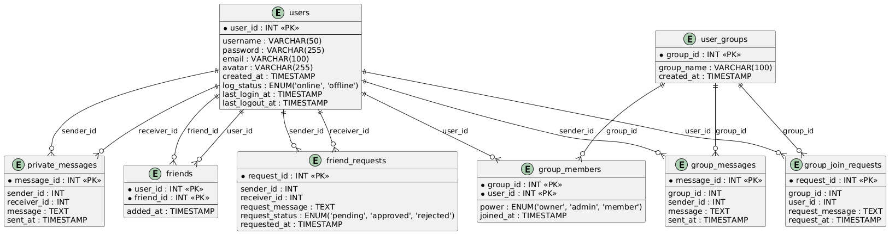
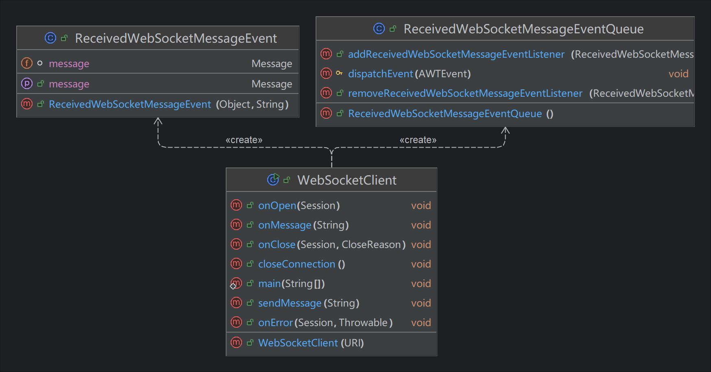
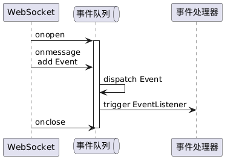
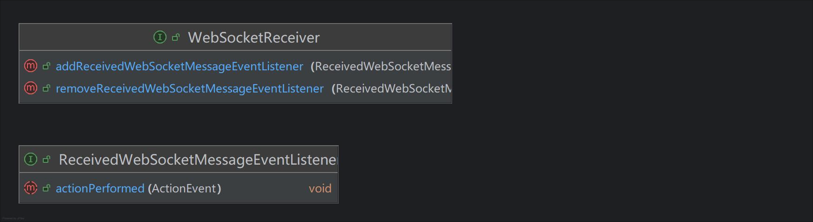

# 前期功能设计

## 前后端交互设计

---

### 实现多个用户之间的通信：CS 模式



---

### 客户端与数据库数据流交换



---

### 前后端数据交互的代码基础



---

### 数据库表及其相互关系



---

### 前后端数据交互的基础：Entry 实体类

``` Java
public class User {
    private int user_id;
    private String username;
    private String password;
    private String email;
    private String avatar;
    private Timestamp created_at;
    private String log_status;
    private Timestamp last_login_at;
    private Timestamp last_logout_at;

    /* setters and getters */
    public static User fromJson(String json);
    public String toJson();
}
```

---

### 通过 JSON 实现 Java 对象与字节流的转换

```json
{
    "avatar":"Base64String",
    "created_at":"2024-12-21 15:37:43.219",
    "email":"email@123.com",
    "last_login_at":"2024-12-21 15:37:43.219",
    "last_logout_at":"2024-12-21 15:37:43.219",
    "log_status":"online",
    "password":"password",
    "user_id":1,
    "username":"admin"
}
```

---

### 实时性需求不高的通信接口：HTTP API

```json
Post http://<Base URL: 部署的服务器 ip 地址>/demo_webapps/<Sub_URLs>
RequestBody: {
    "type" : "getAll",
    "param" : "String 类型的对应参数，有具体 http api 规定"
}
```

---

### 实时性需求高的通信接口：WebSocket API

**WebSocket 简介**
WebSocket 是一种在单个 TCP 连接上进行全双工通信的协议。WebSocket 使得客户端和服务器之间可以进行实时的双向通信，适用于需要频繁数据交换的应用场景，如在线聊天、实时通知、游戏等。

---

#### WebSocket 的特点

- **全双工通信**：
WebSocket 允许客户端和服务器之间同时发送和接收数据，而不需要像 HTTP 那样每次请求都要建立新的连接。

- **低延迟**：
WebSocket 连接��立后，数据可以在客户端和服务器之间低延迟地传输，适用于实时应用。

- **持久连接**：
一旦 WebSocket 连接建立，除非被显式关闭，否则连接将一直保持打开状态，减少了频繁建立和关闭连接的开销。

---

#### WebSocket API 的设计

``` JSON
{
  "receiver": {"name": "John Doe", "id": "user123", "type": "user"},
  "sender": {"name": "Group Chat", "id": "group456", "type": "group"},
  "messageId": "msg0",
  "type":"getVerificationCode",
  "content":"3432900546@qq.com",
  "timestamp": "2024-11-16T23:51:37.571112700+08:00[GMT+08:00]",
  "status": "sent"
}
```

---

### 客户端响应 WebSocket Server 返回的响应信息

#### WebSocketClient 包简介



---

#### WebSocket的事件分发与捕获

- `ReceivedWebSocketMessageEvent.java`：将接收到的消息封装为一个事件
- `ReceivedWebSocketMessageEventQueue.java`：继承自 `EventQueue` 实现事件分发和监听器管理。
- `WebSocketClient.java`：WebSocket 激活后将系统队列替换为自定义的事件队列 `ReceivedWebSocketMessageEventQueue`。onMessage 接收到服务器回传的消息并向上述事件队列中发布对应消息事件。



---

#### WebSocket的事件响应

- `ReceivedWebSocketMessageEventListener.java`：定义处理接收到的 WebSocket 消息事件的方法的接口，继承自 `ActionListener`。
- `ReceivedWebSocketMessageEventQueue.java`：用于处理接收到的 WebSocket 消息事件的事件队列类，继承自 `EventQueue`，并实现事件分发和监听器管理。

