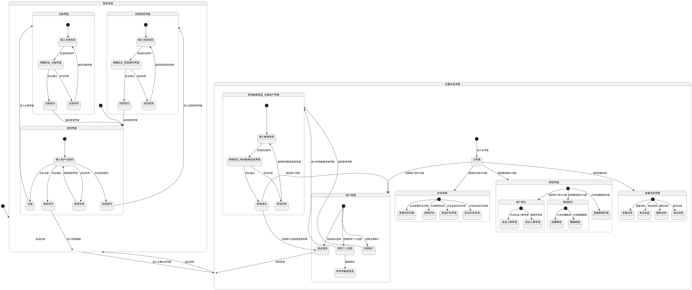

# 前期功能设计

## 面板及其功能设计

---

### 登录流程

1. 启动应用后进入登录流程。
2. 在登录界面，用户可以：
   - 输入用户名密码进行登录。
     - 验证通过则登录成功，进入控制面板。
     - 验证失败则返回登录界面。
   - 点击注册进入注册界面。
   - 点击找回密码进入找回密码界面。

---

### 注册流程

1. 在注册界面，用户输入注册信息。
2. 发送验证邮件进行邮箱验证。
   - 验证通过则注册成功，返回登录界面。
   - 验证失败则返回注册界面。

### 修改密码流程

1. 在找回密码界面，用户输入找回信息。
2. 发送验证邮件进行邮箱验证。
   - 验证通过则找回成功，返回登录界面。
   - 验证失败则返回找回密码界面。

---

### 主要业务流程

1. 登录成功后进入主要业务流程，进入主界面。
2. 在主界面，用户可以选择：
   - 好友相关功能，进入好友界面。
   - 群组相关功能，进入群组界面。
   - 查看消息，进入查看聊天界面。

### 聊天界面

1. 在查看消息界面，用户可以：
   - 查看消息。
   - 发送消息。

---

### 用户相关界面

1. 在用户相关界面，用户可以：
   - 发送好友申请
   - 处理他人申请

### 群组相关界面

1. 在群组相关界面，用户可以：
   - 加入群组
   - 管理员及群主处理他人申请
   - 创建群组
   - 解散群组

---

### 面板功能转化自动机图

